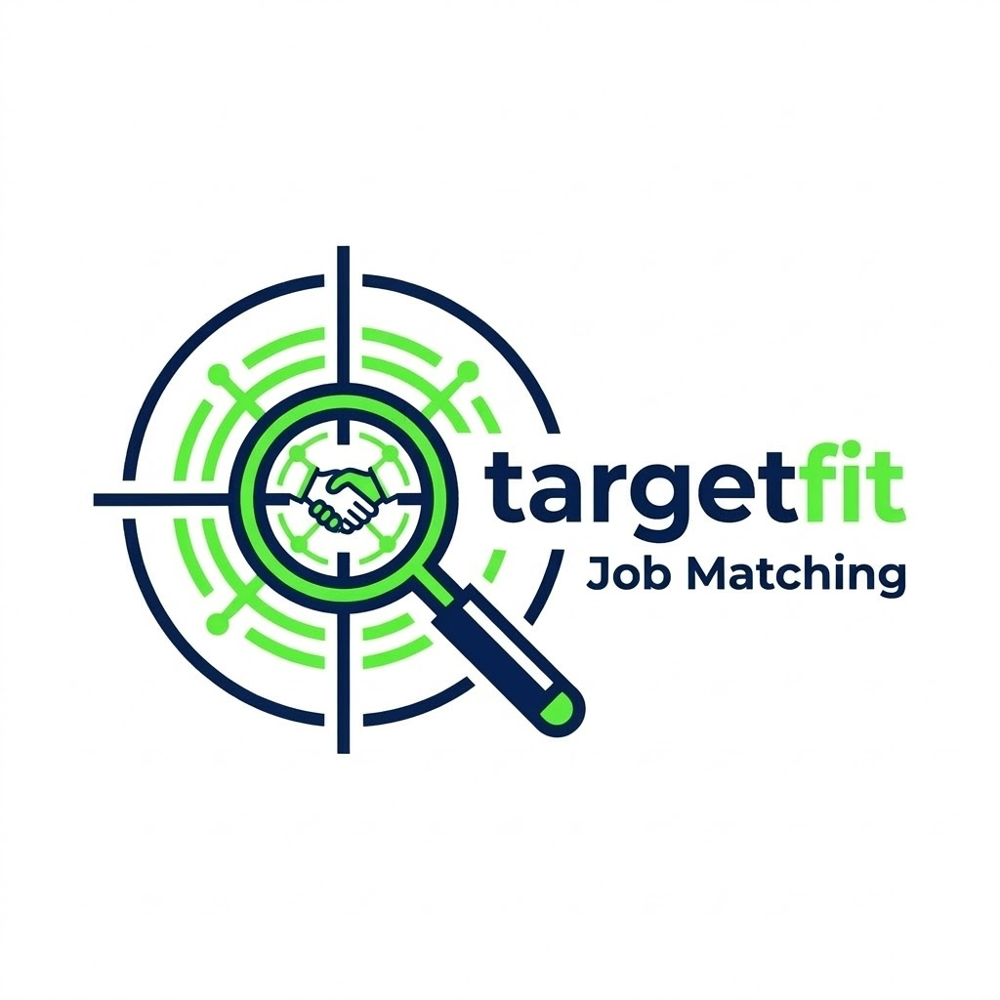

<p align="center">
  
</p>

<h1 align="center">targetfit</h1>

<p align="center">
  High-throughput screening for your next role.<br>
  Scrape target company careers pages, index jobs into DuckDB with vector embeddings,<br>
  and match your CV using cosine similarity + optional LLM scoring — fully local via <b>Ollama</b>.
</p>

---

## Features

- **Company-centric pipeline**: manage your target list via `data/companies.csv` or the `add` / `remove` CLI commands.
- **ATS-aware fetching**: auto-detects Greenhouse, Lever, Ashby, and SmartRecruiters boards and hits their public APIs directly — fast and structured, no browser needed.
- **Playwright pagination**: for other career sites, renders pages in a headless browser, clicks through pagination (Next / Load More), and dismisses cookie overlays automatically.
- **Dual extraction**: tries structured HTML attributes first (`data-ph-at-*` / Phenom People), falls back to ScrapeGraphAI + Ollama LLM extraction.
- **CV-driven search**: parses your CV with Ollama to build targeted search queries so you hit real results pages, not generic landing pages.
- **Vector + LLM scoring**: fast cosine similarity via DuckDB HNSW, with optional richer LLM-based re-scoring.
- **Rich terminal UI**: colour-coded tables, score histograms, and per-company breakdowns via `viz`.
- **Fully local**: all LLM inference runs on your Ollama instance. No data leaves your machine.

---

## Repository layout

```text
targetfit/
├── config.yaml                        # model + DB configuration
├── prompts.md                         # LLM agent prompts (scorer, CV parser)
├── pyproject.toml                     # project metadata + dependencies
├── data/
│   ├── companies.example.csv          # sample — copy to companies.csv
│   ├── companies.csv                  # your company list (git-ignored)
│   ├── cv.txt                         # your CV (plain text, git-ignored)
│   ├── jobs/                          # per-company JSON (e.g. roche.json)
│   └── targetfit.duckdb               # DuckDB database (git-ignored)
├── targetfit/                         # Python package
│   ├── __init__.py
│   ├── __main__.py                    # python -m targetfit
│   ├── cli.py                         # Click CLI (fetch, index, match, …)
│   ├── config.py                      # load_config(), PROJECT_ROOT
│   ├── log.py                         # coloured logger
│   ├── helpers.py                     # truncate()
│   ├── scoring.py                     # ranking, thresholding, formatting
│   ├── viz.py                         # Rich terminal dashboard
│   ├── ingestion/
│   │   ├── scrape.py                  # Playwright + ScrapeGraphAI
│   │   ├── ats_api.py                 # Greenhouse / Lever / Ashby / SmartRecruiters
│   │   └── url_builder.py             # search URL construction for 40+ ATS platforms
│   ├── nlp/
│   │   ├── llm.py                     # Ollama wrapper (scoring + embeddings)
│   │   └── cv_parser.py               # CV → SearchTerms
│   └── storage/
│       ├── db.py                      # DuckDB schema, upsert, vector search
│       └── io.py                      # CSV / JSON / CV file helpers
└── tests/
    └── __init__.py
```

---

## End-to-end flow

```text
     +----------------------+              +----------------------+
     |  data/companies.csv  |              | direct job URL(s)    |
     +----------+-----------+              +----------+-----------+
             |                                     |
             | `fetch` / `fetch-kw`                | `job`
             v                                     v
      +------------------------------+       scrape.fetch_job_url()
      | optional CV → search terms   |                  |
      | (`cv_parser.SearchTerms`)    |                  |
      +--------------+---------------+                  |
            |                                  |
            v                                  |
       +-----------------------------+               |
       | ATS detected?               |               |
       | yes -> ats_api (API call)   |               |
       | no  -> Playwright + LLM     |               |
       +--------------+--------------+               |
               |                               |
               v                               v
      save_company_jobs(company[, keyword])      save_company_jobs("direct")
               |                               |
               +-------------+-----------------+
                       |
                       v
                   data/jobs/*.json
                       |
            +----------------+----------------+
            |                                 |
            v                                 v
         llm.get_embedding()               llm.get_embedding()
         (job descriptions)                (CV text from data/cv.txt)
            |                                 |
            v                                 v
        db.upsert_jobs()                  db.upsert_cv()
            |                                 |
            +----------------+----------------+
                       v
                   data/targetfit.duckdb
             (jobs table + embeddings + HNSW index)
                       |
                       v
                   db.query_similar_jobs()
                       |
                       v
                   scoring.rank_by_vector()
                       |
          +---------------------+---------------------+
          |                                           |
          | `--llm-score`                             | vector-only
          v                                           v
       scoring.rank_by_llm()                    final_score = vector_score
       scoring.apply_combined_scores()
          |                                           |
          +---------------------+---------------------+
                       v
                scoring.filter_by_threshold()
                       |
                       v
                  Terminal output / viz dashboard
```

---

## Installation

```bash
git clone <repo-url> && cd targetfit
python -m venv .venv
source .venv/bin/activate      # macOS / Linux
pip install -e ".[dev]"        # installs the package + dev tools (pytest, ruff)
playwright install chromium    # headless browser for non-ATS career sites
```

You also need **Ollama** running locally with the models configured in `config.yaml`:

```bash
# Extraction + scoring
ollama pull gpt-oss:20b

# Fallback model
ollama pull gemma3:27b

# Embedding model
ollama pull snowflake-arctic-embed2
```

DuckDB is installed as a Python dependency; the VSS extension is loaded at runtime.

---

## Configuration

Edit `config.yaml` at the project root:

```yaml
extraction_model: gpt-oss:20b        # LLM for ScrapeGraphAI extraction
scoring_model: gpt-oss:20b           # LLM for CV-to-job scoring
fallback_model: gemma3:27b           # secondary model for robustness
ollama_url: http://localhost:11434
embedding_model: snowflake-arctic-embed2
embedding_dims: 768
db_path: data/targetfit.duckdb
score_threshold: 0.65                 # minimum final_score to display
top_k: 20                            # vector candidates before re-scoring
max_description_chars: 4000
headless: true                        # run Playwright headless
llm_max_tokens: 8192
location: Switzerland                 # used for search URL templates
```

---

## Quick start

```bash
cp data/companies.example.csv data/companies.csv   # add your target companies
cp ~/cv.txt data/cv.txt                             # add your CV (plain text)
targetfit fetch                                     # scrape careers pages
targetfit index                                     # embed into DuckDB
targetfit viz --top 15 --detail                     # see matches
```

---

## Typical session

```bash
# 1. Set up your data
cp data/companies.example.csv data/companies.csv
cp ~/cv.txt data/cv.txt

# 2. Add companies (ATS platforms are auto-detected)
targetfit add "Lila Sciences" "https://job-boards.greenhouse.io/lilasciences"
targetfit add "Roche" "https://careers.roche.com/global/en/c/research-development-jobs"
targetfit add "CuspAI" "https://jobs.ashbyhq.com/cuspai"

# 3. Scrape + extract jobs → data/jobs/*.json
targetfit fetch

# 4. Scrape a single company
targetfit fetch --company Roche --no-cv-parse

# 5. Fetch a specific posting by direct URL
targetfit job https://jobs.lever.co/acme/abc-123

# 6. Fetch multiple direct URLs from CSV and index immediately
targetfit job --csv my_jobs.csv --index

# 7. Run keyword-targeted scraping across companies
targetfit fetch-kw --keywords bioinformatics --keywords "data science"

# 8. Embed + index into DuckDB
targetfit index

# 9. Fast match (vector only)
targetfit match --top 15

# 10. Rich match (vector + LLM scoring)
targetfit match --top 15 --llm-score

# 11. Visual dashboard
targetfit viz --top 20 --detail
```

`targetfit job` is useful for one-off postings that are easier to collect manually than through a company careers page. It saves results into `data/jobs/direct.json`; with `--index`, it then loads all `data/jobs/*.json` files and updates the DuckDB index in the same run.

Example CSV for `targetfit job --csv`:

```csv
url,company
https://jobs.lever.co/acme/abc-123,Acme Corp
https://boards.greenhouse.io/example/jobs/123456,
```

`targetfit fetch-kw` is useful when a company's landing page or default search path is noisy. It runs each company × keyword combination, saves results into `data/jobs/{company}_{keyword}.json`, and prints a summary of suggested `search_url` fixes or companies that still need manual URL work.

---

## CLI reference

| Command | Description |
|---|---|
| `targetfit fetch` | Scrape careers pages and write per-company JSON files under `data/jobs/`. Parses your CV to build search queries unless `--no-cv-parse` is passed. Use `--company` to target specific companies and `--query` to override search terms. |
| `targetfit fetch-kw` | Run keyword-targeted scraping for each company × keyword combination. Use repeated `--keywords` flags and optional repeated `--company` filters. Saves to `data/jobs/{company}_{keyword}.json` and reports suggested `search_url` fixes when probing succeeds only after auto-detection. |
| `targetfit job URL...` | Fetch one or more specific job postings by direct URL, optionally from `--csv` with columns `url,company`. Saves to `data/jobs/direct.json`. Add `--index` to immediately re-index all saved jobs plus your CV. |
| `targetfit index` | Embed all jobs and your CV via Ollama, upsert into DuckDB with HNSW vector index. |
| `targetfit match` | Retrieve best-matching jobs for your CV. Add `--llm-score` for LLM re-ranking, `--top N` to control result count. |
| `targetfit viz` | Rich terminal dashboard with colour-coded table, score histogram, and company breakdown. Supports `--detail`, `--llm-score`, `--threshold`. |
| `targetfit inspect` | Print all jobs in the database as a simple table. |
| `targetfit add COMPANY URL` | Add a company to `data/companies.csv`. Auto-detects ATS platform. |
| `targetfit remove COMPANY` | Remove a company from the CSV. |
| `targetfit companies` | List all companies. Use `--ats-only` to filter to those with a detected API. |

---

## Example output

See [example.md](example.md) for full terminal output from a pipeline run across 13 companies (pharma + big tech), including:

- `targetfit fetch` — CV-driven search across Google, Roche, Novartis, Pfizer, and 9 more (449 jobs)
- `targetfit viz` — vector-only dashboard with score histogram and company breakdown
- `targetfit viz --llm-score --detail` — LLM-scored dashboard with match reasons, skill gaps, and gap frequency analysis

---

## Privacy and data

- Your **CV** and all **jobs** stay local (`data/cv.txt`, `data/jobs/*.json`, `data/targetfit.duckdb`).
- **No external API calls**: pages are fetched directly, all LLM inference runs on your local Ollama instance.
- `.gitignore` excludes your CV, company list, the DuckDB file, and scraped job JSON.
